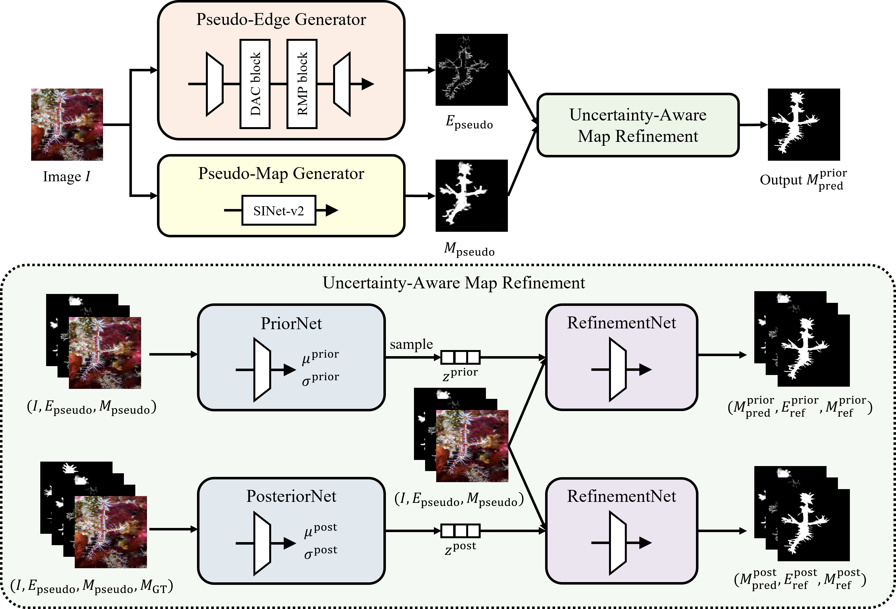

# Improving Camouflaged Object Detection with the Uncertainty of Pseudo-edge Labels (UR-COD)
This is the official implementation of the [paper](https://arxiv.org/abs/2110.15606) in ACM Multimedia Asia 2021.
We provide the sample codes for training and testing and pretrained models on camouflaged object detection.

<p align="left">

</p>

## Requirements
- Python 3.7+
- torch 1.10+
- opencv-python
- numpy
- tqdm

## Installation
1. Clone the repository.
  ```Shell
  git clone git@github.com:nobukatsu-kajiura/UR-COD.git
  ```

2. Download dataset from [here](https://drive.google.com/drive/folders/18fGjoC7KhDBVxfoAUnbsCt56-me4-qbW?usp=sharing).
  Put `TrainDataset` and `TestDataset` directory in `$ROOT/data/`.

3. If you want to try the framework, download the pretrained model from [here](https://drive.google.com/drive/folders/140Z5ugoAOFQw3vWDeIP_wL4XlWBE33rV?usp=sharing) and put `Model_100_gen.pth` in `$ROOT/checkpoints/UR-SINetv2-pretrained/`.

## Training and testing
1. Train the framework.
```Shell
python train.py --name UR-SINetv2 --dataset SINetv2 --epoch 100
```

2. Test the framework.
  When using the pretrained model, use `--name UR-SINetv2-pretrained`.
```Shell
python test.py --name UR-SINetv2 --dataset SINetv2 --epoch 100
```

## References
We used the publicly avaliable model of SINet-v2[Fan+, TPAMI2021] as Pseudo-Map Generator.
We obtained the weights from [here](https://github.com/GewelsJI/SINet-V2) and generated pseudo-map labels.

## Citation
If you find our research useful in your research, please consider citing:

    @inproceedings{kajiura2021improving,
        title={Improving Camouflaged Object Detection with the Uncertainty of Pseudo-edge Labels},
        author={Kajiura, Nobukatsu and Liu, Hong and Satoh, Shin'ichi},
        booktitle = {ACM Multimedia Asia},
        year = {2021}
    }